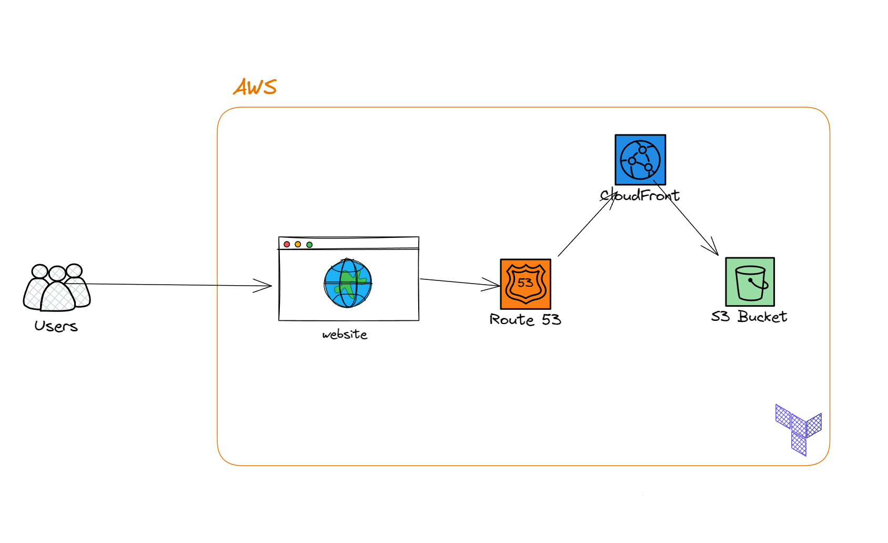

# Deploy infrastructure to AWS with Terraform

This project deploys a static portfolio website to AWS using Terraform. It provisions the required infrastructure for a simple, cost-effective, and scalable website architecture based on Amazon S3 and CloudFront.

## Architecture overview



### Components

- Amazon S3: stores the website files such as HTML, CSS, and assets.
- CloudFront: delivers the website globally through a CDN with HTTPS.
- Route53 + ACM (optional): adds a custom domain and SSL certificate.
- Terraform: manages all AWS resources as code.

### Flow

1. The website files are uploaded to the S3 bucket.
2. CloudFront pulls content from the bucket through an Origin Access Identity (OAI).
3. Users access the website through the CloudFront domain or custom domain.
4. Optional DNS and TLS configuration can be added for production-ready custom domains.

## Project structure

```text
.
├── website/
│   ├── index.html
│   └── style.css
├── .gitignore
├── main.tf
├── variables.tf
├── outputs.tf
├── versions.tf
├── terraform-aws-static-site-diagram.png
├── README.md
└── .terraform/   # generated after terraform init
```

## Prerequisites

Before running this project, make sure you have:

- Terraform installed
- AWS CLI installed and configured
- An AWS account with permissions to create:
  - S3 buckets
  - CloudFront distributions
  - ACM certificates
  - Route53 records

## Configure AWS credentials

Run:

```bash
aws configure
```

Or export your credentials:

```bash
export AWS_ACCESS_KEY_ID=your_access_key
export AWS_SECRET_ACCESS_KEY=your_secret_key
export AWS_DEFAULT_REGION=us-east-1
```

## Initialize and deploy

From the project root:

```bash
terraform init
terraform plan
terraform apply
```

When prompted, confirm the apply step.

## Optional: custom domain

To use a custom domain, update the variables in `terraform.tfvars`:

```hcl
project_name     = "fekry-portfolio"
aws_region       = "us-east-1"
bucket_name      = "my-unique-static-site-bucket"
domain_name      = "www.example.com"
hosted_zone_name = "example.com"
```

Then run:

```bash
terraform apply
```

## Useful outputs

After deployment, Terraform prints useful values including:

- S3 bucket name
- CloudFront distribution ID
- CloudFront domain
- Site URL

## Notes

- The bucket name must be globally unique across all AWS S3 accounts.
- For production use, set a real custom domain and certificate.
- This is a static website setup, so no application server or database is used.

## License

This project is for learning and personal use.
